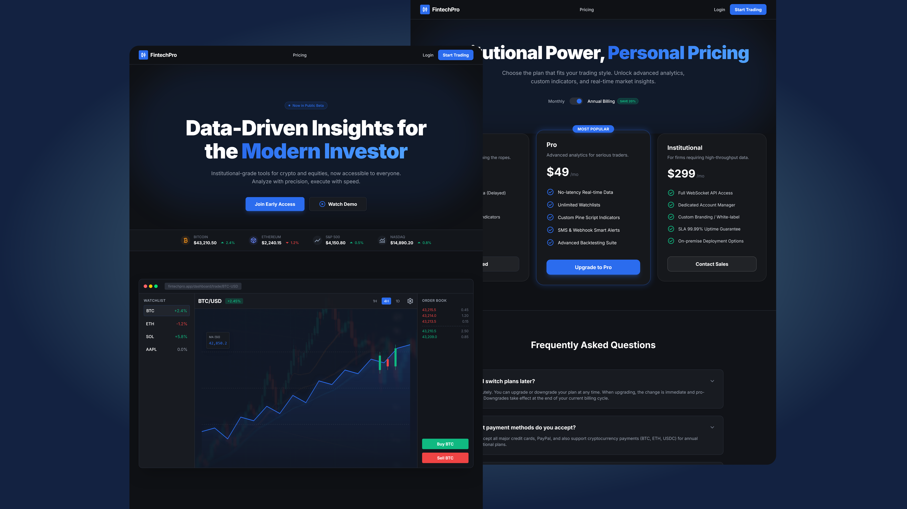

# FintechPro Landing Page

<p align="center">
  
</p>

Modern, high-performance landing page for a financial trading platform built with **Astro 5** and **Tailwind CSS v4**.

## 🚀 Key Features

- **Astro 5**: Lightning-fast static site generation and modern routing.
- **Tailwind CSS v4**: Modern, CSS-first styling engine with `@theme` configuration.
- **Multi-page Architecture**: Optimized landing page and dedicated pricing platform.
- **Responsive Design**: Fully optimized for mobile, tablet, and desktop viewports.
- **Material Symbols**: Integrated icon system with robust translation protection.
- **Enterprise Contact Form**: Integrated glassmorphism contact section.

## 📂 Project Structure

The project follows a modular Astro structure. Styling is centralized in the global CSS using modern v4 standards.

```text
/
├── src/
│   ├── components/       # Reusable UI components
│   │   ├── Navbar.astro           # Sticky header with interactive mobile menu
│   │   ├── Hero.astro             # Main hero section with dual CTAs
│   │   ├── MarketTicker.astro     # Responsive financial price ticker
│   │   ├── PlatformPreview.astro  # Interactive dashboard mockup
│   │   ├── Features.astro         # Service highlights
│   │   ├── CTA.astro              # Enterprise contact form section
│   │   └── Footer.astro           # Brand footer with navigation links
│   ├── layouts/          # Page skeletons
│   │   └── Layout.astro           # Main wrapper with font imports & metadata
│   ├── pages/            # Application routes
│   │   ├── index.astro            # Home landing page
│   │   └── pricing.astro          # Pricing & Plans page (Pro & Institutional)
│   └── styles/           # Styling layer
│       └── global.css             # Tailwind v4 entry & @theme configuration
├── public/               # Static assets
└── astro.config.mjs      # Astro & Vite configuration
```

## 🛠️ Development

### Commands

| Command | Action |
| :--- | :--- |
| `npm install` | Installs project dependencies |
| `npm run dev` | Starts local dev server at `localhost:4321` |
| `npm run build` | Builds the production site to `./dist/` |
| `npm run preview` | Previews the production build locally |

### Key Configuration

- **Theme**: Defined in the `@theme` block within `src/styles/global.css`.
- **Glassmorphism**: UI utilities like `.glass-card` and `.pro-highlight` are available globally.
- **Icons**: Uses Material Symbols Outlined. Protected with `.notranslate` and `translate="no"` to prevent browser interference.
